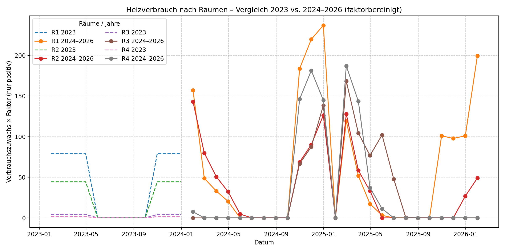
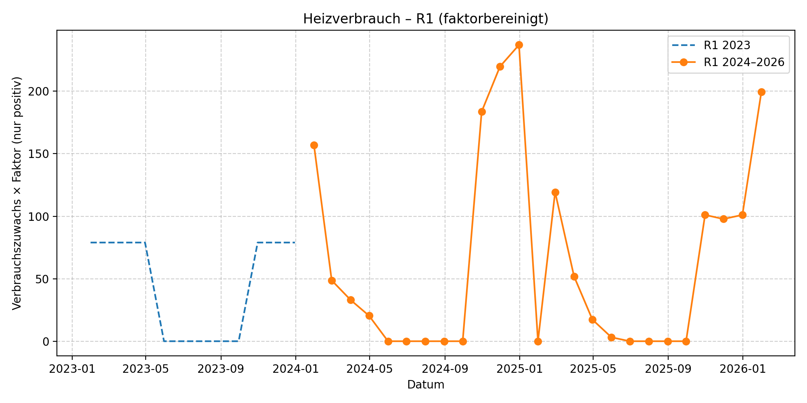
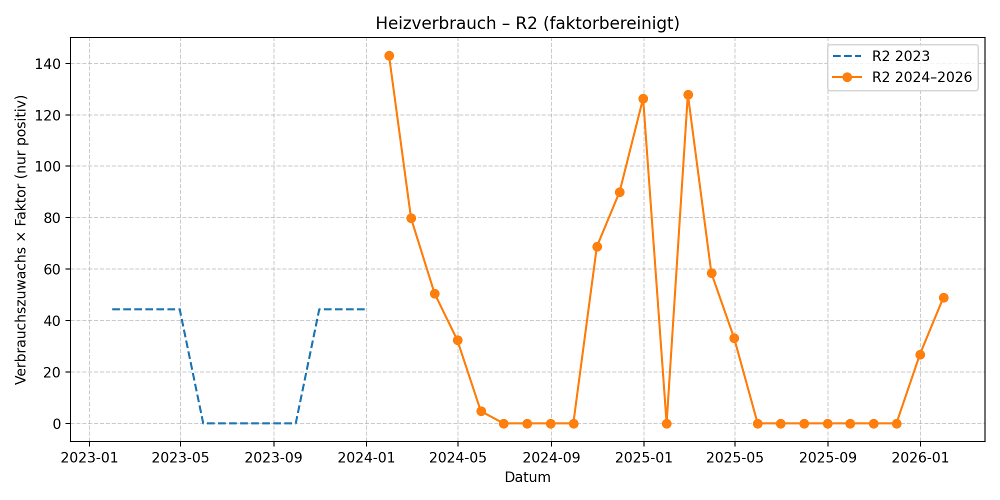
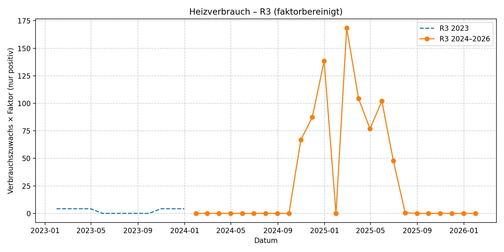
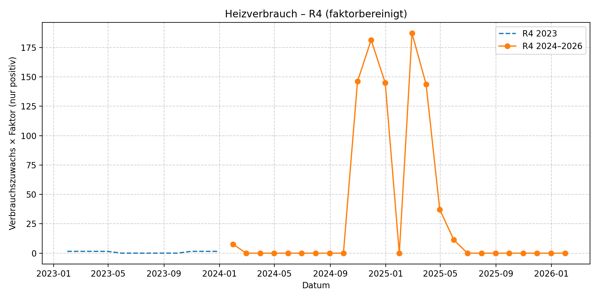

# Heating Consumption Analysis (All Rooms)

Room-level heating consumption plots (factor-adjusted) with a combined comparison chart.
This is a small fun visualization project for personal use and **not** intended to be
complete or fully correct. The project covers **2023** (reconstructed baseline; no more
detailed data was available) and **2024–2026** (from readings).

Built with AI assistance and not optimized for code quality standards, as it's intended
for single-use only.

The data in this repository is **synthetic** and generated for demonstration purposes.

## Outputs

Running the plot script generates PNGs in `output/`:

### Demo Images







## Data Sources

- `data/readings_2023-2026.csv`: cumulative meter readings per room (includes meter swap metadata)
- `data/monthly_increments_factor_adjusted.csv`: monthly increments derived from readings
- `data/totals_2023_weighted.csv`: 2023 annual totals (already factor-adjusted)

## Method

For **2024–2026**:

- Convert cumulative readings into monthly increments
- Keep only **positive** increments (meter resets become 0)
- Multiply increments by the room factor

For **2023**:

- Use the provided annual totals (already factor-adjusted)
- Distribute **equally** over heating months: Jan–Apr and Oct–Dec
- Set May–Sep to 0

## Usage

Install and activate venv (git bash under Windows)

```bash
python3 -m venv .venv
source .venv/Scripts/activate
pip install -r requirements.txt
```

Generate `data/monthly_increments_factor_adjusted.csv` from the readings file:

```bash
python3 build_monthly_increments.py
```

```bash
python3 plot.py
```

## Build Monthly Increments Notes

- The builder derives **positive-only** increments per meter.
- Meter swaps happened for **all four meters**. The builder reconstructs the first
  new-meter reading across the gap between the last old reading and the first new
  reading, distributing it by days across the months in that gap.

## Meter Swap Notes

Meter swaps happened on **2025-09-30** for all four meters. We store this in two ways:

1. `data/readings_2023-2026.csv` includes `meter_id` = `old` / `new`.
   - All rows on/before 2025-09-30 are `old`
   - Rows after 2025-09-30 are `new`

2. `data/monthly_increments_factor_adjusted.csv` includes both:
   - measured monthly increments (positive-only) for 2024/25
   - explicit reconstruction for Winter 2025/26 based on the first new-meter readings:
     - the first new-meter reading is distributed across Oct–Dec 2025 and early Jan 2026
     - later new-meter deltas are assigned to the corresponding months

## License

MIT — see `LICENSE`.
